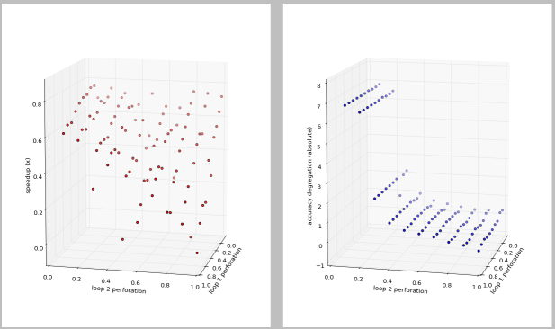

OCaml tools for loop perforation

Following are results from running aperf on a kmeans algorithm. Loop 1
controls the number of points to handle when searching for new centers
and loop 2 controls the number of iterations.

